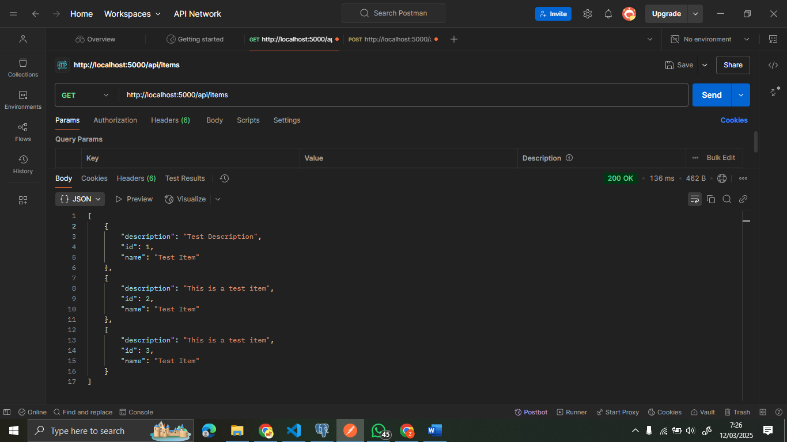
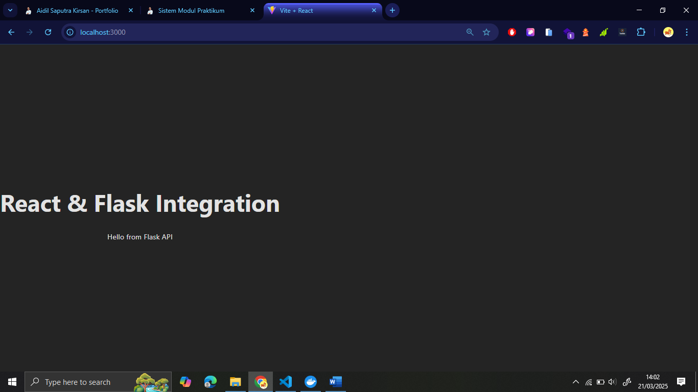
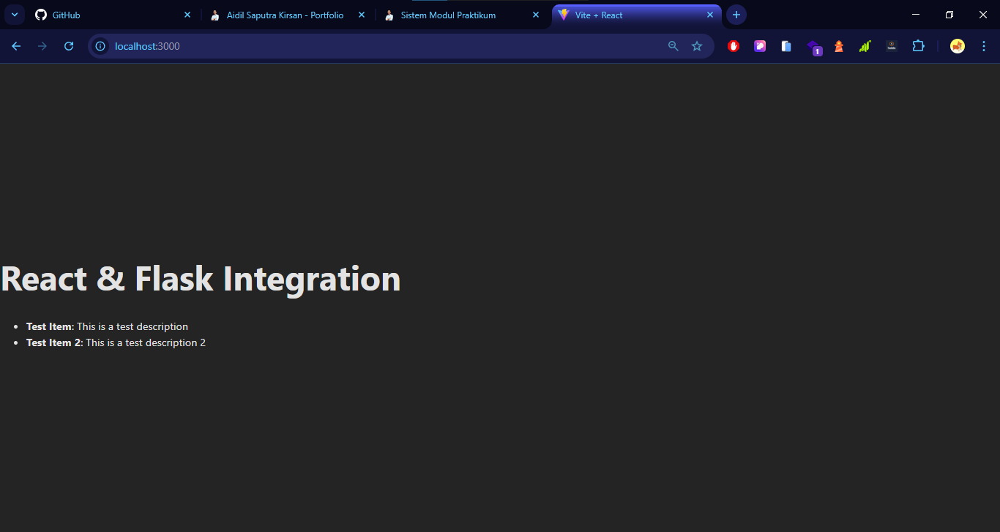

# Cloud-Computing


# Modul Praktikum 02 - Membuat API Sederhana dengan Flask


1. Masuk ke folder backend:
   ```bash
   cd cloud-project/backend
   ```
2. Membuat virtual environment:

    ```bash
    python -m venv venv
    ```

3. Aktivasi virtual environment:

    Untuk Windows:
    ```bash
    venv\Scripts\activate
    ```

4. Menginstal Flask
Instal Flask:
    ```bash
    pip install Flask
    ```


5. Menjalankan Aplikasi Flask
Jalankan aplikasi Flask:
    ```bash
    python app.py
    ```
6. Akses aplikasi flash di browser
    ```bash
    http://127.0.0.1:5000/
    http://localhost:5000/
    ```

# Modul Praktikum 03 - Membuat Aplikasi Frontend Sederhana dengan React + Vite

1. Berpindah ke direktori Frontend serta membuat proyek React baru dengan perintah
    ```bash
    cd frontend
    npm create vite@latest my-react-app -- --template react
    ```

2. Menjalankan React dan Vite menggunakan perintah
    ```bash
    npm run dev
    ```    

3. Membuat halaman sederhana pada src/App dengan code
    ```bash
    import React from 'react';

    function App() {
    return (
        <div style={{ textAlign: 'center', marginTop: '50px' }}>
        <h1>Hello from React + Vite!</h1>
        <p>This is a simple React app built with Vite.</p>
        </div>
    );
    }

    export default App;
    ```
4. Hasil tampilan jika dilihat pada browser
   

# Modul Praktikum 04 - Menghubungkan React ke Flask

1. Menambahkan Endpoint pada Flask <br>
    Pada direktori backend/app.py tambahkan code sebagai berikut
    ```bash
    @app.route('/api/data')
    def get_data():
        return jsonify({"data": "Hello from Flask API"})
    ```
    Sehingga code fullnya seperti 
    ```bash
    from flask import Flask, jsonify

    app = Flask(__name__)

    @app.route('/')
    def home():
        return jsonify({"message": "Hello from Flask!"})

    @app.route('/api/data')
    def get_data():
        return jsonify({"data": "Hello from Flask API"})

    if __name__ == '__main__':
        app.run(debug=True, host='0.0.0.0', port=5000)
    ```
2. Menjalankan Flask dengan cara, pada terminal jalankan
    ```bash
    .\venv\Scripts\activate
    python app.py
    ```
    Kemudian buka browser dengan url
    ```bash
    http://localhost:5000/api/data
    ```

3. Memanggil Endpoint dari React <br>
    Pada file dengan direktori my-react-app/src/App.Jsx tambahkan code sebagai berikut
    ```bash
    import React, { useState, useEffect } from 'react';

    function App() {
    const [apiData, setApiData] = useState(null);

    useEffect(() => {
        fetch('http://localhost:5000/api/data')
        .then(response => response.json())
        .then(data => {
            setApiData(data.data);
        })
        .catch(error => console.error(error));
    }, []);

    return (
        <div style={{ textAlign: 'center', marginTop: '50px' }}>
        <h1>React & Flask Integration</h1>
        <p>{apiData ? apiData : "Loading data..."}</p>
        </div>
    );
    }

    export default App;
    ```
4. Menjalankan Aplikasi React
    Pada terminal jalankan
    ```bash
    npm run dev
    ```
    sehingga pada browser menampilkan
   

5. Jika pada tampilan browser tidak menampilkan data dari Flask, maka tambahkan 
    - Install Flask-Cors
    ```bash
    pip install flask-cors
    ```
    - Tambahkan code di app.y
    ```bash
    from flask_cors import CORS
    CORS(app)
    ```
# Modul Praktikum 05 - Integrasi Flask dengan PostgreSQL

1. Instalasi Psycopg2 (Untuk Koneksi ke PostgreSQL) dengan perintah
```bash
pip install psycopg2-binary
```

2. Menyiapkan Database di pgAdmin Desktop
- Buat Database baru dengan contoh test_db lalu kemudian membuat user baru 
- Membuat table baru dengan perintah
```bash
CREATE TABLE IF NOT EXISTS items (
  id SERIAL PRIMARY KEY,
  name VARCHAR(100),
  description TEXT
);
```

3. Menambahkan Fungsi CRUD
```bash
from flask import request

@app.route('/api/items', methods=['GET'])
def get_items():
    conn = get_db_connection()
    cur = conn.cursor()
    cur.execute("SELECT id, name, description FROM items;")
    rows = cur.fetchall()
    cur.close()
    conn.close()

    items = []
    for row in rows:
        items.append({"id": row[0], "name": row[1], "description": row[2]})
    return jsonify(items)

@app.route('/api/items', methods=['POST'])
def create_item():
    data = request.json
    name = data['name']
    description = data['description']

    conn = get_db_connection()
    cur = conn.cursor()
    cur.execute("INSERT INTO items (name, description) VALUES (%s, %s) RETURNING id;", (name, description))
    new_id = cur.fetchone()[0]
    conn.commit()
    cur.close()
    conn.close()

    return jsonify({"id": new_id, "name": name, "description": description}), 201
```

4. Kemudian jalankan Flask
- dengan perintah
```bash
python app.py
```
- Gunakan Postman untuk mengetes endpoint
   


# Modul Praktikum 06 - Membuat Dockerfile untuk Flask

1. Membuat file pada folder backend dengan nama Dockerfile dengan isi
```bash
# backend/Dockerfile
FROM python:3.9-slim

WORKDIR /app

COPY requirements.txt requirements.txt
RUN pip install --no-cache-dir -r requirements.txt

COPY . .

EXPOSE 5000
CMD ["python", "app.py"]
```

2. tambahkan flask, flask-cors, psycopg2-binary pada file requirements.txt

3. Jalankan perintah berikut untuk membangun image Docker:
```bash
docker build -t flask-backend:1.0 .
```

4. Run Docker Container
```bash
docker run -d -p 5000:5000 --name flask-container flask-backend:1.0
```

5. Melihat hasil pada url http://localhost:5000

# Modul Praktikum 07 - Dockerization Bagian 2 (Membuat Dockerfile untuk React dengan Vite)

1. Membuat file dengan nama Dockerfile pada folder frontend/my-react-app
```bash
FROM node:14-alpine

WORKDIR /app

COPY package*.json ./
RUN npm install

COPY . .

RUN npm run build

FROM nginx:stable-alpine
COPY --from=0 /app/dist /usr/share/nginx/html

EXPOSE 80
CMD ["nginx", "-g", "daemon off;"]
```

2. Build Docker Image dengan cara
```bash
npm run build

#lalu jalankan perintah

docker build -t react-frontend-vite:1.0 .
```

3. Run Docker Container
dengan menjalankan perintah
```bash
docker run -d -p 3000:80 --name react-container-vite react-frontend-vite:1.0
```

4. Kemudian buka browser dengan alamat http://localhost:3000/


# Modul Praktikum 08 - Integrasi Full Stack dengan Docker Compose

1. Membuat file dengan nama docker-compose.yml pada folder project
```bash
version: '3.7'
services:
  backend:
    build: 
      context: ./backend
    container_name: flask_container
    ports:
      - "5000:5000"
    depends_on:
      - db
    environment:
      - DB_HOST=db
      - DB_NAME=test_db
      - DB_USER=student
      - DB_PASSWORD=password

  frontend:
    build:
      context: ./frontend/my-react-app
    container_name: react_container
    ports:
      - "3000:80"
    depends_on:
      - backend

  db:
    image: postgres:12-alpine
    container_name: postgres_container
    environment:
      - POSTGRES_DB=test_db
      - POSTGRES_USER=student
      - POSTGRES_PASSWORD=password
    ports:
      - "5432:5432"
    volumes:
      - db_data:/var/lib/postgresql/data
      - ./init.sql:/docker-entrypoint-initdb.d/init.sql

volumes:
  db_data:
```

2. Membuat file dengan nama init.sql pada folder project
```bash
CREATE TABLE IF NOT EXISTS items (
    id SERIAL PRIMARY KEY,
    name VARCHAR(100) NOT NULL,
    description TEXT
);

INSERT INTO items (name, description) VALUES
('Test Item', 'This is a test description'),
('Test Item 2', 'This is a test description 2');
```

4. Menyesuaikan pada file app.py
```bash
import os
import psycopg2
from flask import Flask, jsonify, request

# Fungsi untuk koneksi ke database PostgreSQL
def get_db_connection():
    conn = psycopg2.connect(
        host=os.environ.get("DB_HOST", "localhost"),
        database=os.environ.get("DB_NAME", "test_db"),
        user=os.environ.get("DB_USER", "student"),
        password=os.environ.get("DB_PASSWORD", "password")
    )
    return conn

# Inisialisasi Flask
app = Flask(__name__)

@app.route('/')
def home():
    return jsonify({"message": "Hello from Flask!"})

# Endpoint untuk membaca data dari tabel 'items'
@app.route('/api/items', methods=['GET'])
def get_items():
    conn = get_db_connection()
    cur = conn.cursor()
    cur.execute("SELECT id, name, description FROM items;")
    rows = cur.fetchall()
    cur.close()
    conn.close()

    items = [{"id": row[0], "name": row[1], "description": row[2]} for row in rows]
    return jsonify(items)

# Endpoint untuk menambahkan data ke tabel 'items'
@app.route('/api/items', methods=['POST'])
def create_item():
    data = request.json
    name = data['name']
    description = data['description']

    conn = get_db_connection()
    cur = conn.cursor()
    cur.execute("INSERT INTO items (name, description) VALUES (%s, %s) RETURNING id;", (name, description))
    new_id = cur.fetchone()[0]
    conn.commit()
    cur.close()
    conn.close()

    return jsonify({"id": new_id, "name": name, "description": description}), 201

# Jalankan Flask
if __name__ == '__main__':
    app.run(debug=True, host='0.0.0.0', port=5000)
```

5. Menyesuaikan pada file App.jsx
```bash
import { useState, useEffect } from "react";

function App() {
  const [items, setItems] = useState([]);
  const [loading, setLoading] = useState(true);

  useEffect(() => {
    fetch("http://localhost:5000/api/items")
      .then((response) => {
        if (!response.ok) {
          throw new Error("Network response was not ok");
        }
        return response.json();
      })
      .then((data) => {
        setItems(data);
        setLoading(false);
      })
      .catch((error) => {
        console.error("Error fetching data:", error);
        setLoading(false);
      });
  }, []);

  if (loading) {
    return <div>Loading data...</div>;
  }

  return (
    <div>
      <h1>React & Flask Integration</h1>
      <ul>
        {items.map((item) => (
          <li key={item.id}>
            <strong>{item.name}</strong>: {item.description}
          </li>
        ))}
      </ul>
    </div>
  );
}

export default App;
```

6. Kemudian menjalankan Docker Compose
Jalankan perintah berikut untuk membangun dan menjalankan semua container:
```bash
docker compose up -d --build
```
kemudian untuk melihat log secara langsung dengan perintah
```bash
docker compose logs -f
```

7. Melihat hasil React dapat berkomunikasi dengan flask dan flask dapat menyimpan data PostfreSQL pada alamat http://localhost:3000

